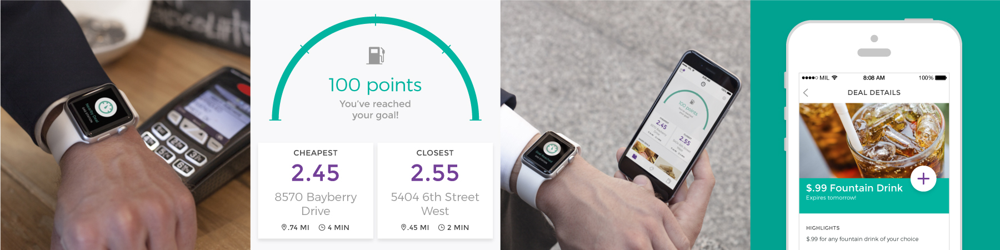

# IBM-Ready-App-for-Loyalty

IBM Ready App for Loyalty is the fifth of the IBM Ready App Series. This app

* addresses all areas of Consumer Loyalty in Retail
  * focuses on Gas Station Loyalty Programs
* emphasizes contextualization which
  * delivers powerful, personalized experiences
  * is pivotal in Consumer Loyalty

### IBM Products

IBM Ready App for Loyalty is made great via

* [**IBM MobileFirst Platform**](http://www-03.ibm.com/software/products/en/mobilefirstplatform)
* [**IBM Bluemix**](https://console.ng.bluemix.net/)
* [**IBM Watson Personality Insights**](http://www.ibm.com/smarterplanet/us/en/ibmwatson/developercloud/personality-insights.html)
* [**IBM Mobile Push Notification**](https://www.ibm.com/cloud/push-notifications)
* [**IBM Cloud Functions**](https://console.bluemix.net/openwhisk/)

  

### Getting Started

Loyalty mobile application is available for iOS and Android.

### iOS 

The user can browse the application without logging in. However, to access user specific deals, add personal interests/preferences, and save deals, they will be prompted to login. A native pop up screen will prompt the user to login in with demo mode.

Press **OK** to launch the demo. If **Cancel** is pressed, the user will have to enter the following credentials to login.

**Username** -  512-867-5309

**Passcode** -  1234     

This app uses geofencing capability to monitor a given radius around the gas stations. When a customer enters the area, personalized deals are sent to them using IBM Cloud functions and IBM Push notification service.
A test simulation gpx file has been provided with the app, which can be used (with xcode) to simulate the push notification on the gas station screen.

Watson Personality Insights adapter has been provided with the app. It retrieves the Watson personality insights for a user. You would normally take a users Twitter feed and supply it to the Watson personality insights service and leverage the results to make informed decisions about what types of offers to make to the user based on their personality. For this simple application we are hard coding the "Twitter feed" that we are supplying the Watson service and are NOT using the results to generate the custom offers we provide for the user as this logic would be very specific to the industry the application is rolled into and the specific business owners needs.

### Android

The Android version of the app uses preemptive login mechanism for user authentication. Username and password need to be same for a successful login. For example, john/john. Loyalty application uses MFP JSONStore to save the deals chosen by the customer. Also,  geofencing capability is used to monitor a given radius around the gas stations. When a customer enters the area, personalized deals are sent to them using IBM Cloud function and IBM Push Notification service. 

### Setup Instructions

1. Download LoyaltyReadyAppiOS/LoyaltyAutoAndroid application.

2. Download and deploy the adapters to MFP Server.

3. Register app with APNS/FCM and get the Push credentials. Deploy IBM Push Notification service on IBM Cloud and update the APNS/FCM push credentials in the service. Update the IBM Push Notification service appId/clientsecret in the Loyalty application.

4. Develop a IBM Cloud function action which can send a push notification. Please refer documentation [here](https://console.bluemix.net/docs/openwhisk/mobile_push_actions.html#openwhisk_catalog_pushnotifications) on the same. It is a simple call for ex,  
*Whisk.invoke(actionNamed:"/whisk.system/pushnotifications/sendMessage",withParameters:["appSecret":"<IBM Push service-appsecret>","appId":"<IBM Push service-appId>","text":<message>,"apiHost":"<hostname.bluemix.net","apnsPayload":<message>])*
	
	After deploying the cloud function, get the endpoint and update the same in the Loyalty application code.  

5.	Register the Loyalty application on MFP server using the MFP admin console. Configure the APNS/FCM Push credentials for the application.

6. Run the application in emulator(for android, use emulator image with Google APIs). For testing the Geofencing feature, click on the 'Cheapest' or 'Closest' gas station tile on the home screen. This will open up the 'Station' map screen with geofence set. To trigger the geofence events, simulate the user location by using the location feature of emulator. For example, set the latitude to 30.4 and longitude to -97.721.	

6.	User can also choose the deals from the deals page and save them. These deals are stored in local JSONStore. As they add the deals, their loyalty points increase.

Note - IBM Push Notification Service works with Android API level 26 and later.

### Documentation
Please visit [this page](https://developer.ibm.com/open/2015/10/19/ibm-ready-app-for-consumer-loyalty/) for more information.
